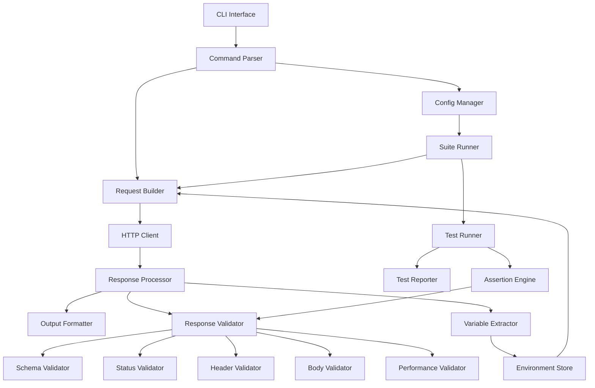

# Design Document

## Overview

Lunge is architected as a modular Go application with clear separation of concerns. The system follows a layered architecture with CLI interface, business logic components, and utility packages. The design emphasizes testability, extensibility, and maintainability while providing a simple user experience.

## Architecture

The system follows a component-based architecture with the following high-level flow:



## Components and Interfaces

### 1. CLI Interface (`internal/cli`)

**Purpose**: Provides command-line interface and command parsing

**Key Components**:
- `root.go`: Main CLI application setup with Cobra
- `get.go`, `post.go`, `put.go`, `delete.go`: Individual HTTP method commands
- `run.go`: Configuration-based request execution
- `test.go`: Test suite execution

**Interfaces**:
```go
type CommandProcessor interface {
    ProcessRequest(args []string) (*http.Response, error)
    ValidateArgs(args []string) error
}
```

### 2. Configuration Management (`internal/config`)

**Purpose**: Loads, validates, and manages JSON configuration files

**Key Components**:
- `loader.go`: Configuration file loading and parsing
- `validator.go`: Configuration structure validation

**Data Models**:
```go
type Config struct {
    Environments map[string]Environment `json:"environments"`
    Requests     map[string]Request     `json:"requests"`
    Suites       map[string]Suite       `json:"suites"`
    Schemas      map[string]Schema      `json:"schemas"`
}

type Environment struct {
    BaseURL   string            `json:"baseUrl"`
    Variables map[string]string `json:"variables"`
}

type Request struct {
    URL         string            `json:"url"`
    Method      string            `json:"method"`
    Headers     map[string]string `json:"headers"`
    QueryParams map[string]string `json:"queryParams"`
    Body        interface{}       `json:"body"`
    Extract     map[string]string `json:"extract"`
    Validate    *Validation       `json:"validate"`
}

type Suite struct {
    Requests  []string          `json:"requests"`
    Variables map[string]string `json:"variables"`
    Tests     []Test            `json:"tests"`
}
```

### 3. HTTP Client (`internal/http`)

**Purpose**: Executes HTTP requests with timing and performance metrics

**Key Components**:
- `client.go`: HTTP client with timeout and tracing
- `request.go`: Request building and variable substitution
- `response.go`: Response processing and data extraction

**Interfaces**:
```go
type HTTPClient interface {
    Execute(req *Request) (*Response, error)
    SetTimeout(duration time.Duration)
}

type Response struct {
    StatusCode int
    Headers    map[string][]string
    Body       []byte
    Timing     TimingMetrics
}

type TimingMetrics struct {
    DNSLookup    time.Duration
    TCPConnect   time.Duration
    TLSHandshake time.Duration
    TTFB         time.Duration
    Total        time.Duration
}
```

### 4. Output Formatting (`internal/output`)

**Purpose**: Formats and displays request/response data in multiple formats

**Key Components**:
- `formatter.go`: Main formatting logic
- `formats.go`: Format-specific implementations (JSON, YAML, JUnit XML)
- `colors.go`: Terminal color management

**Interfaces**:
```go
type Formatter interface {
    FormatRequest(req *Request) string
    FormatResponse(resp *Response) string
    FormatTestResults(results *TestResults) string
}

type OutputFormat string
const (
    FormatText  OutputFormat = "text"
    FormatJSON  OutputFormat = "json"
    FormatYAML  OutputFormat = "yaml"
    FormatJUnit OutputFormat = "junit"
)
```

### 5. Response Validation and Testing

**Purpose**: Validates responses and executes test assertions

**Key Components**:
- Status validation for HTTP status codes
- Header validation with multiple comparison types
- JSONPath-based body validation
- JSON Schema validation
- Performance/timing validation

**Interfaces**:
```go
type Validator interface {
    Validate(response *Response, criteria interface{}) ValidationResult
}

type AssertionEngine interface {
    EvaluateAssertion(assertion Assertion, response *Response) AssertionResult
}

type Assertion struct {
    Type     string      `json:"type"`
    Property string      `json:"property,omitempty"`
    Value    interface{} `json:"value,omitempty"`
    Operator string      `json:"operator,omitempty"`
}
```

### 6. Variable Management (`pkg`)

**Purpose**: Handles variable extraction and substitution

**Key Components**:
- `jsonpath/jsonpath.go`: JSONPath expression evaluation
- Template variable substitution using `{{variable}}` syntax

**Interfaces**:
```go
type VariableExtractor interface {
    Extract(response *Response, rules map[string]string) map[string]interface{}
}

type VariableSubstituter interface {
    Substitute(template string, variables map[string]interface{}) string
}
```

## Data Models

### Configuration Structure

The system uses a hierarchical configuration structure:

1. **Environments**: Define base URLs and environment-specific variables
2. **Requests**: Define reusable HTTP request templates
3. **Suites**: Group requests and define test scenarios
4. **Schemas**: Define JSON schemas for response validation

### Variable Scoping

Variables follow a precedence hierarchy:
1. Extracted variables (highest precedence)
2. Suite-specific variables
3. Environment variables
4. Default values (lowest precedence)

### Test Execution Flow

1. Load configuration and validate structure
2. Select environment and apply base configuration
3. Execute requests in suite order
4. Extract variables from responses
5. Run test assertions against responses
6. Generate consolidated test report

## Error Handling

### Configuration Errors
- Invalid JSON structure
- Missing required fields
- Invalid variable references
- Schema validation failures

### Runtime Errors
- Network connectivity issues
- HTTP request failures
- Assertion failures
- Variable extraction errors

### Error Reporting
- Detailed error messages with context
- Structured error information in JSON/YAML formats
- Exit codes for CI/CD integration

## Testing Strategy

### Unit Testing
- Individual component testing with mocks
- Configuration validation testing
- Assertion engine testing
- Variable substitution testing

### Integration Testing
- End-to-end request execution
- Configuration file processing
- Test suite execution
- Output format validation

### Test Coverage
- Comprehensive test coverage for core components
- Edge case testing for assertion types
- Error condition testing
- Performance regression testing

## Performance Considerations

### HTTP Client Optimization
- Connection pooling and reuse
- Configurable timeouts
- Efficient response body handling
- Memory management for large responses

### Configuration Processing
- Lazy loading of configuration sections
- Efficient variable substitution
- Minimal memory footprint for large configurations

### Output Generation
- Streaming output for large responses
- Efficient JSON/YAML serialization
- Minimal memory allocation in formatters

## Security Considerations

### Credential Management
- No credential storage in configuration files
- Environment variable support for sensitive data
- Secure handling of authentication headers

### Input Validation
- Configuration file validation
- URL validation and sanitization
- Header value validation
- Request body validation

### Output Security
- Sensitive data masking in logs
- Secure temporary file handling
- Memory cleanup for sensitive data

## Extensibility Points

### Custom Validators
- Plugin interface for custom assertion types
- Extensible validation criteria
- Custom schema formats

### Output Formats
- Pluggable formatter interface
- Custom report templates
- Integration with external tools

### Authentication Methods
- Extensible authentication handlers
- OAuth2 flow support
- Custom header generation

## Dependencies

### External Libraries
- `github.com/spf13/cobra`: CLI framework
- `github.com/fatih/color`: Terminal colors
- `github.com/tidwall/gjson`: JSON parsing and JSONPath
- `github.com/santhosh-tekuri/jsonschema/v5`: JSON Schema validation
- `gopkg.in/yaml.v3`: YAML processing

### Standard Library Usage
- `net/http`: HTTP client functionality
- `encoding/json`: JSON processing
- `time`: Timing and duration handling
- `regexp`: Regular expression matching
- `os`: Environment variable access