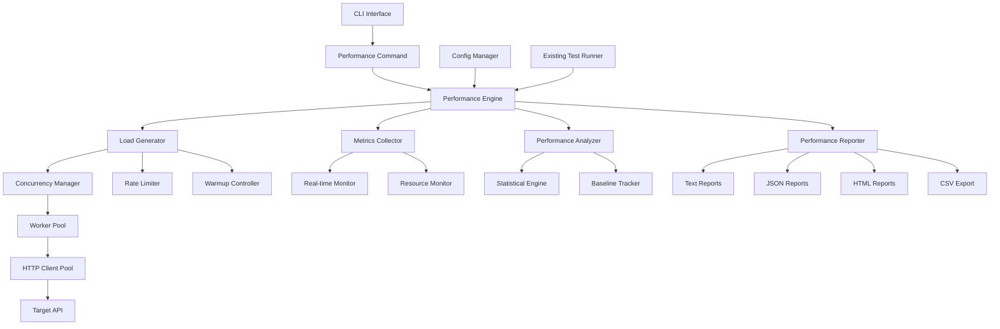

# Design Document

## Overview

The performance testing feature extends Lunge with comprehensive load testing capabilities. The design integrates seamlessly with the existing architecture while adding new components for concurrent execution, performance analysis, and advanced reporting. The system supports various load patterns, real-time monitoring, and detailed performance analytics.

## Architecture

The performance testing system extends the existing Lunge architecture with new performance-focused components:



## Components and Interfaces

### 1. Performance Engine (`internal/performance`)

**Purpose**: Orchestrates performance test execution and coordinates all performance components

**Key Components**:
- `engine.go`: Main performance test orchestration
- `config.go`: Performance-specific configuration management
- `scheduler.go`: Test execution scheduling and coordination

**Interfaces**:
```go
type PerformanceEngine interface {
    ExecutePerformanceTest(config *PerformanceConfig) (*PerformanceResult, error)
    ExecuteLoadTest(config *LoadTestConfig) (*LoadTestResult, error)
    GetRealTimeMetrics() *RealTimeMetrics
    StopTest() error
}

type PerformanceConfig struct {
    Request         string            `json:"request"`
    Concurrency     int               `json:"concurrency"`
    Iterations      int               `json:"iterations,omitempty"`
    Duration        time.Duration     `json:"duration,omitempty"`
    RPS             float64           `json:"rps,omitempty"`
    RampUp          time.Duration     `json:"rampUp,omitempty"`
    RampDown        time.Duration     `json:"rampDown,omitempty"`
    Warmup          WarmupConfig      `json:"warmup,omitempty"`
    Thresholds      ThresholdConfig   `json:"thresholds,omitempty"`
    Monitoring      MonitoringConfig  `json:"monitoring,omitempty"`
}
```

### 2. Load Generator (`internal/performance/load`)

**Purpose**: Manages concurrent request execution and load distribution

**Key Components**:
- `generator.go`: Core load generation logic
- `worker.go`: Individual worker implementation
- `pool.go`: Worker pool management

**Interfaces**:
```go
type LoadGenerator interface {
    Start(config *LoadConfig) error
    Stop() error
    GetMetrics() *LoadMetrics
    AddWorker() error
    RemoveWorker() error
}

type Worker interface {
    Start(ctx context.Context, requests <-chan *WorkItem) error
    Stop() error
    GetStats() *WorkerStats
}

type WorkItem struct {
    Request     *http.Request
    StartTime   time.Time
    WorkerID    int
    SequenceID  int64
}
```

### 3. Concurrency Manager (`internal/performance/concurrency`)

**Purpose**: Controls concurrent worker execution and scaling

**Key Components**:
- `manager.go`: Concurrency control logic
- `scaler.go`: Dynamic scaling implementation
- `limiter.go`: Resource limiting

**Interfaces**:
```go
type ConcurrencyManager interface {
    SetConcurrency(level int) error
    GetCurrentConcurrency() int
    ScaleTo(target int, duration time.Duration) error
    GetWorkerStats() []WorkerStats
}

type ScalingStrategy interface {
    CalculateNextStep(current, target int, elapsed time.Duration) int
    IsComplete(current, target int) bool
}
```

### 4. Rate Limiter (`internal/performance/rate`)

**Purpose**: Controls request rate and timing distribution

**Key Components**:
- `limiter.go`: Rate limiting implementation
- `patterns.go`: Rate pattern implementations
- `distributor.go`: Request distribution logic

**Interfaces**:
```go
type RateLimiter interface {
    Wait(ctx context.Context) error
    SetRate(rps float64) error
    GetCurrentRate() float64
    GetPattern() RatePattern
}

type RatePattern interface {
    GetRate(elapsed time.Duration) float64
    IsComplete(elapsed time.Duration) bool
}

// Built-in patterns
type ConstantRate struct {
    RPS float64
}

type LinearRamp struct {
    StartRPS, EndRPS float64
    Duration         time.Duration
}

type StepPattern struct {
    Steps []RateStep
}
```

### 5. Metrics Collector (`internal/performance/metrics`)

**Purpose**: Collects and aggregates performance metrics

**Key Components**:
- `collector.go`: Metrics collection logic
- `aggregator.go`: Statistical aggregation
- `storage.go`: Metrics storage and retrieval

**Interfaces**:
```go
type MetricsCollector interface {
    RecordRequest(result *RequestResult) error
    GetSnapshot() *MetricsSnapshot
    GetTimeSeries() *TimeSeriesData
    Reset() error
}

type RequestResult struct {
    StartTime       time.Time
    EndTime         time.Time
    Duration        time.Duration
    StatusCode      int
    Error           error
    BytesReceived   int64
    WorkerID        int
    SequenceID      int64
    TimingBreakdown TimingBreakdown
}

type MetricsSnapshot struct {
    TotalRequests     int64
    SuccessfulRequests int64
    FailedRequests    int64
    ResponseTimes     ResponseTimeStats
    Throughput        ThroughputStats
    ErrorRates        ErrorRateStats
    Timestamp         time.Time
}
```

### 6. Performance Analyzer (`internal/performance/analysis`)

**Purpose**: Analyzes performance data and identifies patterns

**Key Components**:
- `analyzer.go`: Core analysis logic
- `statistics.go`: Statistical calculations
- `patterns.go`: Pattern detection
- `regression.go`: Regression analysis

**Interfaces**:
```go
type PerformanceAnalyzer interface {
    AnalyzeResults(metrics *MetricsSnapshot) *AnalysisResult
    DetectAnomalies(timeSeries *TimeSeriesData) []Anomaly
    CompareWithBaseline(current, baseline *MetricsSnapshot) *ComparisonResult
    GenerateInsights(analysis *AnalysisResult) []Insight
}

type AnalysisResult struct {
    Summary           PerformanceSummary
    ResponseTimeStats ResponseTimeAnalysis
    ThroughputStats   ThroughputAnalysis
    ErrorAnalysis     ErrorAnalysis
    Recommendations   []Recommendation
    Anomalies         []Anomaly
}

type ResponseTimeAnalysis struct {
    Percentiles map[string]time.Duration // P50, P90, P95, P99
    Mean        time.Duration
    Median      time.Duration
    StdDev      time.Duration
    Min         time.Duration
    Max         time.Duration
    Distribution []TimeBucket
}
```

### 7. Performance Reporter (`internal/performance/reporting`)

**Purpose**: Generates comprehensive performance reports

**Key Components**:
- `reporter.go`: Main reporting logic
- `text.go`: Text report generation
- `json.go`: JSON report generation
- `html.go`: HTML report generation
- `csv.go`: CSV export functionality

**Interfaces**:
```go
type PerformanceReporter interface {
    GenerateReport(result *PerformanceResult, format ReportFormat) ([]byte, error)
    GenerateRealTimeReport(metrics *RealTimeMetrics) ([]byte, error)
    ExportCSV(timeSeries *TimeSeriesData) ([]byte, error)
    GenerateChart(data *ChartData, chartType ChartType) ([]byte, error)
}

type ReportFormat string
const (
    ReportText ReportFormat = "text"
    ReportJSON ReportFormat = "json"
    ReportHTML ReportFormat = "html"
    ReportCSV  ReportFormat = "csv"
)
```

### 8. Resource Monitor (`internal/performance/monitoring`)

**Purpose**: Monitors system resource usage during tests

**Key Components**:
- `monitor.go`: Resource monitoring logic
- `cpu.go`: CPU usage monitoring
- `memory.go`: Memory usage monitoring
- `network.go`: Network monitoring

**Interfaces**:
```go
type ResourceMonitor interface {
    Start() error
    Stop() error
    GetSnapshot() *ResourceSnapshot
    GetTimeSeries() *ResourceTimeSeries
}

type ResourceSnapshot struct {
    CPUUsage    float64
    MemoryUsage int64
    NetworkIO   NetworkStats
    Timestamp   time.Time
}
```

## Data Models

### Configuration Extensions

```go
// Extend existing Config struct
type Config struct {
    // ... existing fields ...
    Performance map[string]PerformanceTest `json:"performance,omitempty"`
}

type PerformanceTest struct {
    Name        string                 `json:"name"`
    Request     string                 `json:"request"`
    Load        LoadConfig            `json:"load"`
    Monitoring  MonitoringConfig      `json:"monitoring,omitempty"`
    Thresholds  ThresholdConfig       `json:"thresholds,omitempty"`
    Reporting   ReportingConfig       `json:"reporting,omitempty"`
}

type LoadConfig struct {
    Concurrency int           `json:"concurrency"`
    Iterations  int           `json:"iterations,omitempty"`
    Duration    string        `json:"duration,omitempty"`
    RPS         float64       `json:"rps,omitempty"`
    RampUp      string        `json:"rampUp,omitempty"`
    RampDown    string        `json:"rampDown,omitempty"`
    Pattern     string        `json:"pattern,omitempty"`
    Warmup      WarmupConfig  `json:"warmup,omitempty"`
}

type ThresholdConfig struct {
    MaxResponseTime string  `json:"maxResponseTime,omitempty"`
    MaxErrorRate    float64 `json:"maxErrorRate,omitempty"`
    MinThroughput   float64 `json:"minThroughput,omitempty"`
}
```

### Performance Results

```go
type PerformanceResult struct {
    TestName      string                `json:"testName"`
    StartTime     time.Time            `json:"startTime"`
    EndTime       time.Time            `json:"endTime"`
    Duration      time.Duration        `json:"duration"`
    Configuration PerformanceConfig    `json:"configuration"`
    Metrics       MetricsSnapshot      `json:"metrics"`
    Analysis      AnalysisResult       `json:"analysis"`
    TimeSeries    TimeSeriesData       `json:"timeSeries"`
    Resources     ResourceTimeSeries   `json:"resources"`
}
```

## CLI Integration

### New Commands

```bash
# Run performance test
lunge perf -c config.json -e dev -p loadTest

# Run with specific parameters
lunge perf -c config.json -e dev -r getUsers --concurrency 50 --duration 5m

# Real-time monitoring
lunge perf -c config.json -e dev -p loadTest --real-time

# Generate reports
lunge perf -c config.json -e dev -p loadTest --format html --output report.html

# Compare with baseline
lunge perf -c config.json -e dev -p loadTest --baseline --compare
```

### Flag Extensions

```go
perfCmd.Flags().StringP("performance", "p", "", "Performance test to run")
perfCmd.Flags().Int("concurrency", 10, "Number of concurrent requests")
perfCmd.Flags().String("duration", "", "Test duration (e.g., 5m, 30s)")
perfCmd.Flags().Int("iterations", 0, "Number of iterations")
perfCmd.Flags().Float64("rps", 0, "Requests per second")
perfCmd.Flags().String("ramp-up", "", "Ramp-up duration")
perfCmd.Flags().String("ramp-down", "", "Ramp-down duration")
perfCmd.Flags().Bool("real-time", false, "Enable real-time monitoring")
perfCmd.Flags().Bool("baseline", false, "Save as baseline")
perfCmd.Flags().Bool("compare", false, "Compare with baseline")
perfCmd.Flags().String("output", "", "Output file for reports")
```

## Error Handling

### Performance-Specific Errors

```go
type PerformanceError struct {
    Type    ErrorType
    Message string
    Cause   error
}

type ErrorType string
const (
    ErrorConcurrencyLimit ErrorType = "concurrency_limit"
    ErrorRateLimit       ErrorType = "rate_limit"
    ErrorResourceLimit   ErrorType = "resource_limit"
    ErrorThreshold       ErrorType = "threshold_exceeded"
    ErrorConfiguration   ErrorType = "configuration_error"
)
```

## Testing Strategy

### Unit Testing
- Load generator component testing
- Metrics collection accuracy testing
- Statistical calculation validation
- Rate limiting precision testing

### Integration Testing
- End-to-end performance test execution
- Multi-scenario test validation
- Resource monitoring accuracy
- Report generation testing

### Performance Testing
- Self-testing with known performance characteristics
- Baseline establishment and regression detection
- Resource usage validation
- Scalability testing

## Security Considerations

### Resource Protection
- Maximum concurrency limits to prevent system overload
- Memory usage monitoring and limits
- CPU usage monitoring and throttling
- Network bandwidth considerations

### Target Protection
- Rate limiting to prevent overwhelming target systems
- Configurable delays and backoff strategies
- Connection pooling limits
- Graceful degradation on errors

## Extensibility Points

### Custom Load Patterns
- Plugin interface for custom rate patterns
- Configurable load distribution strategies
- Custom warmup strategies

### Custom Metrics
- Plugin interface for custom metric collection
- Custom analysis algorithms
- Integration with external monitoring systems

### Custom Reports
- Template-based report generation
- Custom chart types and visualizations
- Integration with external reporting tools

## Dependencies

### New Dependencies
- `golang.org/x/time/rate`: Rate limiting
- `github.com/shirou/gopsutil/v3`: System monitoring
- `github.com/go-echarts/go-echarts/v2`: Chart generation (optional)
- `gonum.org/v1/gonum/stat`: Statistical calculations

### Performance Considerations
- Efficient memory management for large datasets
- Streaming metrics collection
- Concurrent-safe data structures
- Minimal overhead monitoring