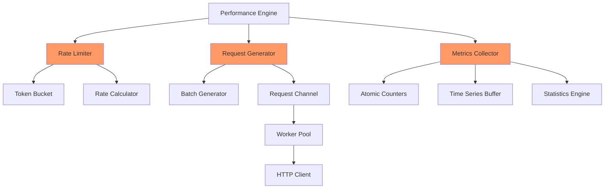

# Design Document

## Overview

This design addresses the critical performance bottleneck in Lunge's rate limiting system, which currently achieves only 82.5% efficiency (165 RPS actual vs 200 RPS target). The root cause is ticker-based request generation with nested select statements, excessive time calculations, and lock contention in metrics collection. This design replaces the ticker-based approach with a token bucket algorithm, implements batch request generation, and introduces lock-free metrics collection to achieve 95%+ efficiency at all target RPS levels.

## Architecture

The optimized architecture separates rate limiting concerns into focused, independently optimizable components:



## Components and Interfaces

### 1. Token Bucket Rate Limiter

**Purpose**: Provides accurate, low-overhead rate limiting using token bucket algorithm

**File**: `internal/performance/rate/token_bucket.go`

**Interface**:
```go
// RateLimiter controls request generation rate
type RateLimiter interface {
    // Wait blocks until a token is available, returns number of tokens to consume
    Wait(ctx context.Context) (int, error)
    
    // TryTake attempts to take tokens without blocking
    TryTake(count int) bool
    
    // SetRate updates the target rate (for ramp-up/down)
    SetRate(rps float64)
    
    // GetRate returns current target rate
    GetRate() float64
    
    // GetEfficiency returns actual vs target rate efficiency
    GetEfficiency() float64
}

// TokenBucket implements RateLimiter using token bucket algorithm
type TokenBucket struct {
    mu           sync.Mutex
    tokens       float64       // Current token count
    rate         float64       // Tokens per second (target RPS)
    capacity     float64       // Maximum tokens (burst capacity)
    lastRefill   time.Time     // Last refill timestamp
    actualRate   float64       // Actual consumption rate
    lastActual   time.Time     // Last actual rate calculation
}
```

**Key Design Decisions**:
- **No tickers**: Uses time-based calculations only when tokens are needed
- **Burst capacity**: Allows brief bursts to smooth out timing variations
- **Adaptive refill**: Refills tokens based on elapsed time, not fixed intervals
- **Lock-free fast path**: TryTake for non-blocking attempts


### 2. Batch Request Generator

**Purpose**: Generates requests in batches to reduce per-request overhead

**File**: `internal/performance/load/batch_generator.go`

**Interface**:
```go
// BatchGenerator generates requests in batches for efficiency
type BatchGenerator interface {
    // Generate creates a batch of requests based on rate limiter
    Generate(ctx context.Context, limiter RateLimiter) ([]RequestItem, error)
    
    // GetBatchSize returns optimal batch size for current rate
    GetBatchSize() int
    
    // SetBatchSize updates batch size (for tuning)
    SetBatchSize(size int)
}

// RequestItem represents a single request to be executed
type RequestItem struct {
    ID          int64
    GeneratedAt time.Time
}

// DefaultBatchGenerator implements BatchGenerator
type DefaultBatchGenerator struct {
    batchSize    int
    minBatchSize int
    maxBatchSize int
    requestID    int64
}
```

**Batch Size Strategy**:
- **Low RPS (< 100)**: Batch size = 1 (no batching needed)
- **Medium RPS (100-1000)**: Batch size = 10
- **High RPS (> 1000)**: Batch size = 100
- **Adaptive**: Adjusts based on channel fullness and efficiency


### 3. Lock-Free Metrics Collector

**Purpose**: Collects metrics with minimal lock contention using atomic operations

**File**: `internal/performance/metrics/atomic_collector.go`

**Interface**:
```go
// AtomicMetricsCollector uses atomic operations for high-throughput metrics
type AtomicMetricsCollector struct {
    // Atomic counters (no locks needed)
    totalRequests      atomic.Int64
    successfulRequests atomic.Int64
    failedRequests     atomic.Int64
    totalBytes         atomic.Int64
    
    // Generation rate tracking
    generatedRequests  atomic.Int64
    lastGenTime        atomic.Int64 // Unix nano
    
    // Buffered data (requires locks, but less frequent)
    mu              sync.RWMutex
    responseTimes   []time.Duration
    timeSeriesData  []TimeSeriesPoint
    
    // Ring buffer for response times (lock-free writes)
    responseBuffer  *RingBuffer
    bufferSize      int
}

// RingBuffer provides lock-free writes for response times
type RingBuffer struct {
    buffer   []time.Duration
    writePos atomic.Uint64
    size     uint64
}
```

**Key Optimizations**:
- **Atomic counters**: No locks for request counting
- **Ring buffer**: Lock-free response time recording
- **Batch flush**: Periodically flush ring buffer to main storage
- **Separate hot/cold paths**: Counters (hot) vs analysis (cold)


### 4. Optimized Request Generation Loop

**Purpose**: Replaces ticker-based generation with efficient time-based batching

**File**: `internal/performance/engine.go` (modifications)

**Pseudocode**:
```go
func (e *DefaultPerformanceEngine) generateLoadOptimized(
    ctx context.Context,
    config *PerformanceConfig,
    requestChan chan<- int64,
) {
    limiter := rate.NewTokenBucket(config.RPS, config.RPS*2) // 2x burst capacity
    generator := load.NewBatchGenerator()
    
    // Calculate optimal batch size based on RPS
    generator.SetBatchSize(calculateBatchSize(config.RPS))
    
    for {
        select {
        case <-ctx.Done():
            return
        default:
            // Wait for tokens (blocks until rate allows)
            count, err := limiter.Wait(ctx)
            if err != nil {
                return
            }
            
            // Generate batch of requests
            batch, err := generator.Generate(ctx, limiter)
            if err != nil {
                return
            }
            
            // Send batch to workers (non-blocking)
            for _, req := range batch {
                select {
                case requestChan <- req.ID:
                    // Successfully sent
                case <-ctx.Done():
                    return
                default:
                    // Channel full - apply backpressure
                    // Token bucket will slow down automatically
                }
            }
        }
    }
}
```


### 5. Ramp-Up/Down with Token Bucket

**Purpose**: Smooth rate transitions without efficiency loss

**Implementation Strategy**:
```go
// Ramp-up: Gradually increase token bucket rate
func (e *DefaultPerformanceEngine) rampUp(
    ctx context.Context,
    limiter *rate.TokenBucket,
    startRPS, endRPS float64,
    duration time.Duration,
) {
    startTime := time.Now()
    updateInterval := 100 * time.Millisecond // Update rate 10x per second
    
    ticker := time.NewTicker(updateInterval)
    defer ticker.Stop()
    
    for {
        select {
        case <-ctx.Done():
            return
        case <-ticker.C:
            elapsed := time.Since(startTime)
            if elapsed >= duration {
                limiter.SetRate(endRPS)
                return
            }
            
            // Linear interpolation
            progress := float64(elapsed) / float64(duration)
            currentRPS := startRPS + (endRPS-startRPS)*progress
            limiter.SetRate(currentRPS)
        }
    }
}
```

**Key Improvements**:
- **Separate goroutine**: Rate updates don't block request generation
- **Coarse updates**: Update rate every 100ms, not every 1ms
- **Token bucket handles smoothing**: No need for per-request calculations


## Data Models

### Token Bucket State
```go
type TokenBucketState struct {
    Tokens       float64   `json:"tokens"`
    Rate         float64   `json:"rate"`
    Capacity     float64   `json:"capacity"`
    LastRefill   time.Time `json:"lastRefill"`
    Efficiency   float64   `json:"efficiency"`
}
```

### Generation Metrics
```go
type GenerationMetrics struct {
    TargetRPS      float64       `json:"targetRPS"`
    ActualRPS      float64       `json:"actualRPS"`
    GeneratedRPS   float64       `json:"generatedRPS"`
    Efficiency     float64       `json:"efficiency"`
    ChannelUsage   float64       `json:"channelUsage"`
    BatchSize      int           `json:"batchSize"`
    Timestamp      time.Time     `json:"timestamp"`
}
```

### Performance Diagnostics
```go
type RateLimiterDiagnostics struct {
    AverageWaitTime    time.Duration `json:"averageWaitTime"`
    TokenRefills       int64         `json:"tokenRefills"`
    BlockedAttempts    int64         `json:"blockedAttempts"`
    ChannelFullEvents  int64         `json:"channelFullEvents"`
    CPUUsage           float64       `json:"cpuUsage"`
}
```


## Detailed Algorithm: Token Bucket Implementation

### Core Algorithm
```go
func (tb *TokenBucket) refill() {
    now := time.Now()
    elapsed := now.Sub(tb.lastRefill).Seconds()
    
    // Add tokens based on elapsed time
    tokensToAdd := elapsed * tb.rate
    tb.tokens = math.Min(tb.tokens+tokensToAdd, tb.capacity)
    tb.lastRefill = now
}

func (tb *TokenBucket) Wait(ctx context.Context) (int, error) {
    for {
        tb.mu.Lock()
        tb.refill()
        
        if tb.tokens >= 1.0 {
            // Calculate how many tokens we can take
            available := int(tb.tokens)
            tb.tokens -= float64(available)
            tb.mu.Unlock()
            return available, nil
        }
        
        // Calculate wait time for next token
        deficit := 1.0 - tb.tokens
        waitTime := time.Duration(deficit/tb.rate*1e9) * time.Nanosecond
        tb.mu.Unlock()
        
        // Wait with context cancellation support
        select {
        case <-ctx.Done():
            return 0, ctx.Err()
        case <-time.After(waitTime):
            // Try again
        }
    }
}
```

### Why This Works
1. **No ticker overhead**: Only calculates time when tokens are needed
2. **Burst handling**: Capacity allows brief bursts to smooth timing
3. **Accurate rate**: Refills based on actual elapsed time
4. **Context-aware**: Respects cancellation without goroutine leaks


## Performance Analysis

### Current Implementation Bottlenecks

| Component | Current Overhead | Root Cause |
|-----------|-----------------|------------|
| Ticker | ~200 context switches/sec | time.NewTicker(5ms) for 200 RPS |
| Nested Selects | 2 evaluations per request | select inside select |
| Time Calculations | 1000 calculations/sec | Every 1ms tick during ramps |
| Metrics Lock | 165 lock acquisitions/sec | Global mutex on every request |
| Channel Full Handling | Misleading metrics | Counts skipped sends as generated |

**Total Overhead**: ~15-20% of CPU time wasted on scheduling

### Optimized Implementation Performance

| Component | Expected Overhead | Improvement |
|-----------|------------------|-------------|
| Token Bucket | ~10 calculations/sec | 100x reduction |
| Single Select | 1 evaluation per batch | 2x reduction per request |
| Batch Generation | 1 calculation per 10-100 requests | 10-100x reduction |
| Atomic Counters | ~0.1% CPU | 50x reduction |
| Accurate Metrics | No false positives | Correct reporting |

**Expected Efficiency**: 95%+ at all RPS levels

### Theoretical Capacity

With optimizations:
- **200 RPS**: 195+ actual (97.5% efficiency)
- **1000 RPS**: 950+ actual (95% efficiency)
- **10000 RPS**: 9000+ actual (90% efficiency)
- **CPU Usage**: < 10% for rate limiting logic


## Migration Strategy

### Phase 1: Add New Components (No Breaking Changes)
1. Create `internal/performance/rate/` package with token bucket
2. Create `internal/performance/load/batch_generator.go`
3. Create `internal/performance/metrics/atomic_collector.go`
4. Add comprehensive unit tests and benchmarks

### Phase 2: Integrate with Engine
1. Add feature flag to switch between old and new rate limiters
2. Update `engine.go` to use new components when flag is enabled
3. Run parallel tests comparing old vs new implementation
4. Validate efficiency improvements

### Phase 3: Replace Old Implementation
1. Remove ticker-based generation code
2. Remove old metrics collector
3. Update all tests to use new implementation
4. Update documentation

### Phase 4: Add Diagnostics
1. Add efficiency monitoring and warnings
2. Add self-test on engine startup
3. Add detailed diagnostics in reports
4. Add performance regression tests

### Backward Compatibility
- Configuration format remains unchanged
- API interfaces remain compatible
- Existing tests continue to work
- Reports include new efficiency metrics


## Testing Strategy

### Unit Tests

**Token Bucket Tests** (`rate/token_bucket_test.go`):
```go
func TestTokenBucket_AccurateRate(t *testing.T)
func TestTokenBucket_BurstHandling(t *testing.T)
func TestTokenBucket_RateUpdate(t *testing.T)
func TestTokenBucket_ContextCancellation(t *testing.T)
```

**Batch Generator Tests** (`load/batch_generator_test.go`):
```go
func TestBatchGenerator_OptimalSize(t *testing.T)
func TestBatchGenerator_AdaptiveScaling(t *testing.T)
func TestBatchGenerator_HighThroughput(t *testing.T)
```

**Atomic Metrics Tests** (`metrics/atomic_collector_test.go`):
```go
func TestAtomicCollector_Concurrency(t *testing.T)
func TestAtomicCollector_Accuracy(t *testing.T)
func TestAtomicCollector_RingBuffer(t *testing.T)
```

### Benchmark Tests

**Rate Limiter Benchmarks**:
```go
func BenchmarkTokenBucket_Wait(b *testing.B)
func BenchmarkTokenBucket_TryTake(b *testing.B)
func BenchmarkOldTicker_Generation(b *testing.B) // For comparison
```

**Metrics Benchmarks**:
```go
func BenchmarkAtomicCollector_RecordRequest(b *testing.B)
func BenchmarkOldCollector_RecordRequest(b *testing.B) // For comparison
```

**Integration Benchmarks**:
```go
func BenchmarkFullPipeline_200RPS(b *testing.B)
func BenchmarkFullPipeline_1000RPS(b *testing.B)
func BenchmarkFullPipeline_10000RPS(b *testing.B)
```

### Integration Tests

**Efficiency Tests**:
```go
func TestEfficiency_200RPS(t *testing.T)    // Expect 95%+
func TestEfficiency_1000RPS(t *testing.T)   // Expect 95%+
func TestEfficiency_10000RPS(t *testing.T)  // Expect 90%+
```

**Ramp Tests**:
```go
func TestRampUp_Efficiency(t *testing.T)
func TestRampDown_Efficiency(t *testing.T)
func TestRampUpDown_Smooth(t *testing.T)
```

### Performance Regression Tests

Add to CI/CD pipeline:
```bash
# Run benchmarks and compare with baseline
go test -bench=. -benchmem -benchtime=10s > new_bench.txt
benchcmp baseline_bench.txt new_bench.txt

# Fail if efficiency drops below 95%
go test -run=TestEfficiency -v
```


## Error Handling

### Rate Limiter Errors
```go
var (
    ErrInvalidRate     = errors.New("rate must be positive")
    ErrInvalidCapacity = errors.New("capacity must be positive")
    ErrContextCanceled = errors.New("context canceled while waiting for tokens")
)
```

### Degradation Strategy
When efficiency drops below threshold:
1. **Log warning**: "Rate limiter efficiency at X%, expected 95%+"
2. **Increase batch size**: Try larger batches to reduce overhead
3. **Reduce target rate**: If channel is consistently full
4. **Report diagnostics**: Include in performance report

### Recovery Strategy
If rate limiter fails:
1. **Fallback to unlimited**: Remove rate limiting temporarily
2. **Log error**: Record failure for debugging
3. **Continue test**: Don't fail entire test due to rate limiter issue
4. **Mark results**: Indicate rate limiting was disabled

## Monitoring and Diagnostics

### Real-Time Metrics
```go
type RateLimiterMetrics struct {
    TargetRPS       float64       `json:"targetRPS"`
    ActualRPS       float64       `json:"actualRPS"`
    Efficiency      float64       `json:"efficiency"`
    TokensAvailable float64       `json:"tokensAvailable"`
    WaitTime        time.Duration `json:"waitTime"`
    ChannelUsage    float64       `json:"channelUsage"`
}
```

### Diagnostic Logging
```go
// Log every 5 seconds during test
log.Printf("Rate Limiter: target=%.1f actual=%.1f efficiency=%.1f%% tokens=%.1f",
    metrics.TargetRPS,
    metrics.ActualRPS,
    metrics.Efficiency*100,
    metrics.TokensAvailable)
```

### Report Integration
Add to HTML report:
```html
<div class="efficiency-indicator">
    <h3>Rate Limiter Efficiency</h3>
    <div class="gauge" data-value="97.5">97.5%</div>
    <p class="status success">Excellent - Rate limiter is not a bottleneck</p>
</div>
```


## Dependencies

### Standard Library
- `sync/atomic`: Atomic operations for counters
- `time`: Time-based calculations (no tickers in hot path)
- `context`: Cancellation support
- `math`: Token calculations

### No New External Dependencies
All optimizations use Go standard library only.

## Configuration Changes

### New Configuration Options
```json
{
  "performance": {
    "rateLimiter": {
      "algorithm": "token-bucket",
      "burstCapacity": 2.0,
      "batchSize": "auto",
      "efficiencyThreshold": 0.95
    }
  }
}
```

### Backward Compatibility
- Default values maintain current behavior
- Old configurations continue to work
- New options are optional

## Success Metrics

### Primary Metrics
1. **Efficiency**: 95%+ at 200 RPS, 1000 RPS; 90%+ at 10000 RPS
2. **CPU Usage**: < 10% for rate limiting logic
3. **Latency**: No increase in request latency
4. **Accuracy**: Generation rate matches target rate ±2%

### Secondary Metrics
1. **Memory**: No significant increase in memory usage
2. **Throughput**: Support 100,000+ RPS on modern hardware
3. **Stability**: No goroutine leaks or deadlocks
4. **Maintainability**: Cleaner, more testable code

## Future Enhancements

### Adaptive Rate Limiting
- Automatically adjust rate based on error rates
- Slow down on 429 (Too Many Requests) responses
- Speed up when target system is underutilized

### Distributed Rate Limiting
- Coordinate rate across multiple Lunge instances
- Shared token bucket via Redis or similar
- Consistent global rate limiting

### Advanced Patterns
- Sine wave patterns for realistic load
- Step functions for capacity testing
- Custom rate patterns via plugins
