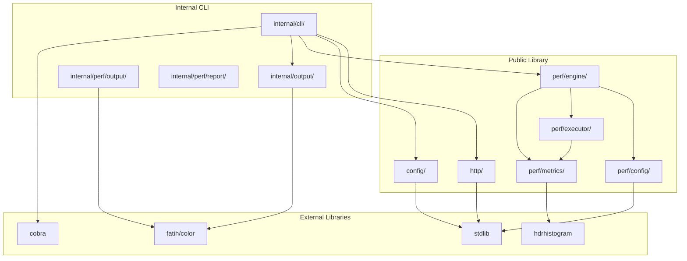

# Lunge Library Design

## Overview

This document outlines a plan for exposing Lunge's functionality as a Go library while maintaining the existing CLI. Currently, all useful code resides in `internal/` packages, which prevents external imports in Go. This design proposes a clear separation between public library APIs and internal CLI implementation.

## Current Architecture Analysis

### Package Structure (Current)

```
internal/
├── cli/                    # CLI commands (Cobra-based)
├── config/                 # JSON config loading & validation
├── http/                   # HTTP client, request, response
├── output/                 # Output formatting (text, JSON, YAML, JUnit)
└── performance/v2/         # Performance testing engine
    ├── config/             # YAML/JSON config parsing
    ├── engine/             # Test orchestration
    ├── executor/           # Load generation strategies
    ├── metrics/            # Metrics collection (HDR histogram)
    ├── output/             # Console output (TTY-aware)
    ├── rate/               # Rate limiting (leaky bucket)
    └── report/             # HTML reporting
```

### Package Analysis Summary

| Package | Lines | Dependencies | Library Candidate | Notes |
|---------|-------|--------------|-------------------|-------|
| `internal/http` | ~430 | Minimal | ✅ Excellent | Clean API, functional options |
| `internal/config` | ~600 | Minimal | ✅ Good | Config types and loading |
| `internal/output` | ~1000 | `internal/http` | ⚠️ Partial | Depends on internal types |
| `internal/cli` | ~1500 | All internal | ❌ No | CLI-specific, stays internal |
| `internal/performance/v2/config` | ~310 | Minimal | ✅ Excellent | Config schema and parsing |
| `internal/performance/v2/engine` | ~700 | Internal v2 | ✅ Good | Core orchestration logic |
| `internal/performance/v2/executor` | ~650 | Internal v2 | ✅ Good | Load generation strategies |
| `internal/performance/v2/metrics` | ~450 | HDR histogram | ✅ Excellent | Lock-free metrics collection |
| `internal/performance/v2/rate` | ~200 | Minimal | ✅ Excellent | Standalone rate limiter |
| `internal/performance/v2/output` | ~400 | Internal v2 | ⚠️ Partial | TTY-specific, may stay internal |
| `internal/performance/v2/report` | ~300 | Internal v2 | ⚠️ Partial | HTML templates, may stay internal |

---

## Proposed Public Package Structure

### Recommended Layout

```
github.com/wesleyorama2/lunge/
├── cmd/lunge/                  # CLI entry point (unchanged)
├── http/                       # PUBLIC: HTTP client library
├── config/                     # PUBLIC: Configuration types
├── perf/                       # PUBLIC: Performance testing library
│   ├── config/                 # Test configuration
│   ├── engine/                 # Test engine
│   ├── executor/               # Load executors
│   └── metrics/                # Metrics collection
├── internal/                   # PRIVATE: CLI-specific code
│   ├── cli/                    # CLI commands
│   └── output/                 # CLI output formatting
└── doc/                        # Documentation
```

### Detailed Package Breakdown

---

## Public Library: `http`

### Purpose
Provide a clean, fluent HTTP client with detailed timing metrics.

### Source Files to Move
- `internal/http/client.go` → `http/client.go`
- `internal/http/request.go` → `http/request.go`
- `internal/http/response.go` → `http/response.go`

### Public API Surface

```go
package http

// Client is an HTTP client with customizable options
type Client struct { ... }

// ClientOption configures a Client
type ClientOption func(*Client)

// NewClient creates a new HTTP client with the given options
func NewClient(options ...ClientOption) *Client

// WithBaseURL sets the base URL for the client
func WithBaseURL(baseURL string) ClientOption

// WithTimeout sets the timeout for the client
func WithTimeout(timeout time.Duration) ClientOption

// WithHeader adds a default header to the client
func WithHeader(key, value string) ClientOption

// Do executes an HTTP request and returns the response with timing info
func (c *Client) Do(ctx context.Context, req *Request) (*Response, error)

// Request represents an HTTP request with builder pattern
type Request struct { ... }

// NewRequest creates a new HTTP request
func NewRequest(method, path string) *Request

// WithHeader adds a header to the request
func (r *Request) WithHeader(key, value string) *Request

// WithQueryParam adds a query parameter
func (r *Request) WithQueryParam(key, value string) *Request

// WithBody sets the request body
func (r *Request) WithBody(body interface{}) *Request

// Response represents an HTTP response with timing info
type Response struct { ... }

// TimingInfo stores detailed timing information
type TimingInfo struct { ... }

// GetBody returns the response body as bytes
func (r *Response) GetBody() ([]byte, error)

// GetBodyAsString returns the response body as a string
func (r *Response) GetBodyAsString() (string, error)

// GetBodyAsJSON unmarshals the response body into v
func (r *Response) GetBodyAsJSON(v interface{}) error

// IsSuccess returns true for 2xx status codes
func (r *Response) IsSuccess() bool
```

### Usage Example

```go
package main

import (
    "context"
    "fmt"
    "time"
    
    lungehttp "github.com/wesleyorama2/lunge/http"
)

func main() {
    client := lungehttp.NewClient(
        lungehttp.WithBaseURL("https://api.example.com"),
        lungehttp.WithTimeout(30*time.Second),
        lungehttp.WithHeader("Authorization", "Bearer token"),
    )
    
    req := lungehttp.NewRequest("GET", "/users").
        WithQueryParam("limit", "10")
    
    resp, err := client.Do(context.Background(), req)
    if err != nil {
        panic(err)
    }
    
    fmt.Printf("Status: %d\n", resp.StatusCode)
    fmt.Printf("DNS Lookup: %v\n", resp.Timing.DNSLookupTime)
    fmt.Printf("TTFB: %v\n", resp.Timing.TimeToFirstByte)
    
    var users []User
    if err := resp.GetBodyAsJSON(&users); err != nil {
        panic(err)
    }
}
```

---

## Public Library: `config`

### Purpose
Provide configuration types and loading/validation utilities for JSON/YAML configs.

### Source Files to Move
- `internal/config/loader.go` → `config/loader.go`
- `internal/config/validator.go` → `config/validator.go`

### Public API Surface

```go
package config

// Config represents the top-level configuration
type Config struct {
    Environments map[string]Environment     `json:"environments"`
    Requests     map[string]Request         `json:"requests"`
    Suites       map[string]Suite           `json:"suites"`
    Schemas      map[string]json.RawMessage `json:"schemas,omitempty"`
}

// Environment represents an environment configuration
type Environment struct {
    BaseURL string            `json:"baseUrl"`
    Headers map[string]string `json:"headers,omitempty"`
    Vars    map[string]string `json:"variables,omitempty"`
}

// Request represents a request configuration
type Request struct {
    URL         string                 `json:"url"`
    Method      string                 `json:"method"`
    Headers     map[string]string      `json:"headers,omitempty"`
    QueryParams map[string]string      `json:"queryParams,omitempty"`
    Body        interface{}            `json:"body,omitempty"`
    Extract     map[string]string      `json:"extract,omitempty"`
    Validate    map[string]interface{} `json:"validate,omitempty"`
}

// LoadConfig loads a configuration from a file
func LoadConfig(path string) (*Config, error)

// ValidateConfig validates the configuration
func ValidateConfig(config *Config) []ValidationError

// ProcessEnvironment processes variable substitution in a string
func ProcessEnvironment(input string, env map[string]string) string
```

---

## Public Library: `perf`

### Purpose
Provide the complete performance testing engine for programmatic use.

### Subpackage Structure

```
perf/
├── config/     # Test configuration types and parsing
├── engine/     # Main test engine
├── executor/   # Load generation executors
└── metrics/    # Metrics collection
```

### `perf/config` - Configuration

```go
package config

// TestConfig is the root configuration for a performance test
type TestConfig struct {
    Name        string                         `yaml:"name"`
    Description string                         `yaml:"description,omitempty"`
    Settings    GlobalSettings                 `yaml:"settings,omitempty"`
    Variables   map[string]string              `yaml:"variables,omitempty"`
    Scenarios   map[string]*ScenarioConfig     `yaml:"scenarios"`
    Thresholds  *ThresholdsConfig              `yaml:"thresholds,omitempty"`
    Options     *ExecutionOptions              `yaml:"options,omitempty"`
}

// LoadConfig loads a test configuration from a YAML file
func LoadConfig(path string) (*TestConfig, error)

// ScenarioConfig defines a single load testing scenario
type ScenarioConfig struct {
    Executor        string                 `yaml:"executor"`
    VUs             int                    `yaml:"vus,omitempty"`
    Duration        string                 `yaml:"duration,omitempty"`
    Rate            float64                `yaml:"rate,omitempty"`
    PreAllocatedVUs int                    `yaml:"preAllocatedVUs,omitempty"`
    MaxVUs          int                    `yaml:"maxVUs,omitempty"`
    Stages          []StageConfig          `yaml:"stages,omitempty"`
    Requests        []RequestConfig        `yaml:"requests"`
}
```

### `perf/engine` - Test Engine

```go
package engine

// Engine is the main orchestrator for performance testing
type Engine struct { ... }

// NewEngine creates a new performance engine
func NewEngine(cfg *config.TestConfig) (*Engine, error)

// Run executes all scenarios and returns the test results
func (e *Engine) Run(ctx context.Context) (*TestResult, error)

// GetMetrics returns the current metrics snapshot
func (e *Engine) GetMetrics() *metrics.Snapshot

// GetProgress returns the overall test progress (0.0 to 1.0)
func (e *Engine) GetProgress() float64

// IsRunning returns true if the engine is currently running
func (e *Engine) IsRunning() bool

// Stop gracefully stops the engine
func (e *Engine) Stop(ctx context.Context) error

// TestResult contains the complete test results
type TestResult struct {
    Name        string                     `json:"name"`
    Duration    time.Duration              `json:"duration"`
    Scenarios   map[string]*ScenarioResult `json:"scenarios"`
    Metrics     *metrics.Snapshot          `json:"metrics"`
    Passed      bool                       `json:"passed"`
    Thresholds  []ThresholdResult          `json:"thresholds,omitempty"`
}
```

### `perf/executor` - Executors

```go
package executor

// Type identifies the type of executor
type Type string

const (
    TypeConstantVUs         Type = "constant-vus"
    TypeRampingVUs          Type = "ramping-vus"
    TypeConstantArrivalRate Type = "constant-arrival-rate"
    TypeRampingArrivalRate  Type = "ramping-arrival-rate"
)

// Executor defines the interface for load generation strategies
type Executor interface {
    Type() Type
    Init(ctx context.Context, config *Config) error
    Run(ctx context.Context, scheduler *VUScheduler, metrics *metrics.Engine) error
    GetProgress() float64
    GetActiveVUs() int
    GetStats() *Stats
    Stop(ctx context.Context) error
}
```

### `perf/metrics` - Metrics

```go
package metrics

// Engine collects and aggregates performance metrics
type Engine struct { ... }

// NewEngine creates a new metrics engine
func NewEngine() *Engine

// RecordLatency records a request latency
func (e *Engine) RecordLatency(duration time.Duration, requestName string, success bool, bytes int64)

// GetSnapshot returns a point-in-time snapshot of all metrics
func (e *Engine) GetSnapshot() *Snapshot

// GetTimeSeries returns time-series buckets
func (e *Engine) GetTimeSeries() []*TimeBucket

// Snapshot contains aggregated metrics at a point in time
type Snapshot struct {
    TotalRequests   int64        `json:"totalRequests"`
    SuccessRequests int64        `json:"successRequests"`
    FailedRequests  int64        `json:"failedRequests"`
    Latency         LatencyStats `json:"latency"`
    RPS             float64      `json:"rps"`
    ErrorRate       float64      `json:"errorRate"`
}

// LatencyStats contains latency percentiles
type LatencyStats struct {
    Min, Max, Mean  time.Duration
    P50, P90, P95, P99 time.Duration
}
```

### Usage Example

```go
package main

import (
    "context"
    "fmt"
    
    "github.com/wesleyorama2/lunge/perf/config"
    "github.com/wesleyorama2/lunge/perf/engine"
)

func main() {
    // Load configuration
    cfg, err := config.LoadConfig("test.yaml")
    if err != nil {
        panic(err)
    }
    
    // Create and run engine
    eng, err := engine.NewEngine(cfg)
    if err != nil {
        panic(err)
    }
    
    result, err := eng.Run(context.Background())
    if err != nil {
        panic(err)
    }
    
    // Access results programmatically
    fmt.Printf("Total Requests: %d\n", result.Metrics.TotalRequests)
    fmt.Printf("P95 Latency: %v\n", result.Metrics.Latency.P95)
    fmt.Printf("Error Rate: %.2f%%\n", result.Metrics.ErrorRate*100)
    fmt.Printf("Passed: %v\n", result.Passed)
}
```

---

## Packages to Keep Internal

### `internal/cli`
CLI commands are specific to the `lunge` binary and should remain internal. They depend on Cobra and output formatting that's CLI-specific.

### `internal/output`
Output formatting (text colors, terminal output) is CLI-specific. If formatting functionality is needed externally, a sanitized subset could be exposed later.

### `internal/performance/v2/output`
Console output (progress bars, TTY detection) is CLI-specific.

### `internal/performance/v2/report`
HTML report generation could potentially be exposed but has dependencies on internal types. Consider exposing later if demand exists.

---

## Migration Strategy

### Phase 1: Create Public Packages (Non-breaking)

1. **Create new top-level packages** matching the proposed structure
2. **Copy and refactor types** ensuring clean public APIs
3. **Update import paths** in new packages
4. **Add comprehensive documentation** and examples
5. **Write tests** for public APIs

### Phase 2: Refactor Internals

1. **Update `internal/cli`** to use new public packages
2. **Remove duplicated code** from internal packages
3. **Ensure CLI still works** identically

### Phase 3: Deprecation (Optional)

1. **Mark internal packages** as deprecated via comments
2. **Update documentation** to point to public packages

### Migration Checklist

```
[ ] Create `http/` package with Client, Request, Response
[ ] Create `config/` package with loader and types
[ ] Create `perf/config/` with TestConfig and parsing
[ ] Create `perf/engine/` with Engine and TestResult
[ ] Create `perf/executor/` with Executor interface and types
[ ] Create `perf/metrics/` with Engine and Snapshot
[ ] Write comprehensive examples
[ ] Write godoc documentation
[ ] Update internal/cli to use public packages
[ ] Update README with library usage examples
[ ] Add library usage guide to doc/
```

---

## API Design Considerations

### Naming Conventions

| Internal Name | Public Name | Rationale |
|--------------|-------------|-----------|
| `http.Client` | `http.Client` | Keep simple |
| `v2.VirtualUser` | Not exposed | Implementation detail |
| `v2.VUScheduler` | Not exposed | Implementation detail |
| `engine.Engine` | `perf.Engine` or `engine.Engine` | Context-appropriate |
| `metrics.Engine` | `metrics.Collector` or `metrics.Engine` | Consider clarity |

### Avoiding Breaking Changes

1. **Use interfaces** where flexibility is needed
2. **Use functional options** for configuration (already done in http/)
3. **Export only what's necessary** - can always add, never remove
4. **Version the API** via module path if needed

### Thread Safety

All public types should document their thread-safety guarantees:
- `http.Client` - Thread-safe, can be shared
- `perf/engine.Engine` - Not for concurrent test runs
- `perf/metrics.Engine` - Thread-safe, uses atomic operations

---

## Friend's Use Case Analysis

Based on the stated use case (getting auth tokens, exercising APIs):

### Recommended Packages

1. **`http/`** - Essential for making requests and getting responses
2. **`config/`** - Useful for loading configuration files
3. **`perf/engine`** - If they want to run load tests programmatically

### Example: Auth Token Flow

```go
package main

import (
    "context"
    "fmt"
    
    lungehttp "github.com/wesleyorama2/lunge/http"
)

func main() {
    client := lungehttp.NewClient(
        lungehttp.WithBaseURL("https://auth.example.com"),
    )
    
    // Get auth token
    req := lungehttp.NewRequest("POST", "/oauth/token").
        WithHeader("Content-Type", "application/x-www-form-urlencoded").
        WithBody("grant_type=client_credentials&client_id=xxx&client_secret=yyy")
    
    resp, err := client.Do(context.Background(), req)
    if err != nil {
        panic(err)
    }
    
    var tokenResp struct {
        AccessToken string `json:"access_token"`
        ExpiresIn   int    `json:"expires_in"`
    }
    if err := resp.GetBodyAsJSON(&tokenResp); err != nil {
        panic(err)
    }
    
    fmt.Printf("Got token (expires in %d seconds)\n", tokenResp.ExpiresIn)
    
    // Use token for API calls
    apiClient := lungehttp.NewClient(
        lungehttp.WithBaseURL("https://api.example.com"),
        lungehttp.WithHeader("Authorization", "Bearer "+tokenResp.AccessToken),
    )
    
    // Make authenticated requests
    resp, _ = apiClient.Do(context.Background(), lungehttp.NewRequest("GET", "/users"))
    fmt.Printf("Users API Status: %d\n", resp.StatusCode)
}
```

---

## Diagram: Package Dependencies



---

## Recommendations Summary

### Immediate Actions

1. **Extract `http/` package first** - Cleanest, most useful for the friend's use case
2. **Document public APIs thoroughly** - Godoc comments on all exported types
3. **Create examples/** directory - With working code samples

### Medium-term Actions

1. **Extract `perf/` packages** - For performance testing library use
2. **Refactor CLI** - To consume public packages
3. **Add integration tests** - Ensure CLI behavior unchanged

### Long-term Considerations

1. **Semantic versioning** - Start at v0.x until API stabilizes
2. **Module split?** - Consider `go.wesleyorama2/lunge-perf` if packages diverge
3. **API evolution** - Design for backward compatibility

---

## Implementation Priority

| Priority | Package | Effort | Impact |
|----------|---------|--------|--------|
| 1 | `http/` | Low | High - Solves friend's use case |
| 2 | `config/` | Low | Medium - Enables config loading |
| 3 | `perf/metrics` | Medium | Medium - Standalone metrics |
| 4 | `perf/engine` | High | High - Full perf testing |
| 5 | `perf/executor` | Medium | Medium - Custom executors |

---

## Conclusion

This design provides a clear path to exposing Lunge's functionality as a library while keeping the CLI functional. The key principles are:

1. **Minimal public surface** - Only expose what's necessary
2. **Clean dependencies** - Public packages don't depend on internal
3. **Backward compatible** - CLI continues to work as before
4. **Incremental migration** - Can be done in phases

The recommended starting point is the `http/` package, which directly addresses the friend's use case and has the cleanest API surface.